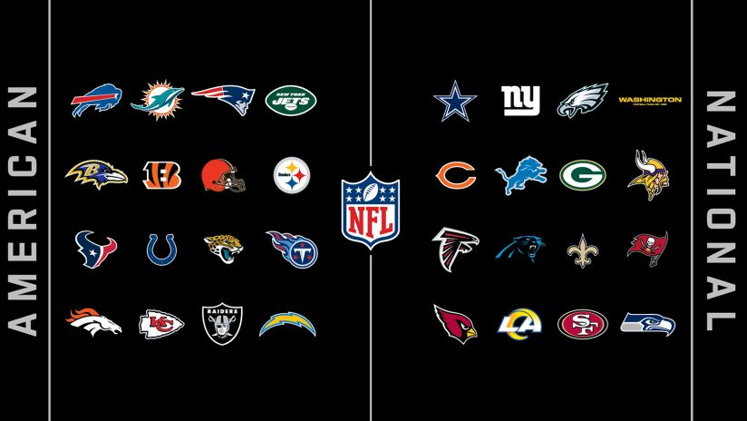

```{r setup, include=FALSE}
knitr::opts_chunk$set(
  attr.source='.numberLines',
  echo = FALSE, 
  message = FALSE, 
  warning = FALSE,
  cache = FALSE,
  #engine.path = list(r = '', pyton = ''), 
  tidy = "formatR", tidy.opts = list(width.cutoff = 60), #tidy = "styler", 
  fig.align = "center", fig.pos = "h", fig.height = 3.5, fig.width = 5.5, fig.pos = 'H'
  )
options(
  digits = 2, 
  OutDec = ".", 
  digits = 2, scipen = 4, 
  xtable.comment = FALSE
  )
```


```{r}
library(tidyverse)
library(factoextra)
library(ggimage)
library(ggrepel)
library(ape)
library(ggdendro)
```


\vspace{-14mm}

# Introdução

\vspace{-3mm}

A NFL (National Football League) é a principal liga de futebol americano e faz parte da vida de torcedores espalhados pelos Estados Unidos e por todo o mundo. Ela possui 32 times, divididos em 2 conferências, a AFC (American Football Conference) e a NFC (National Football Conference) conforme a Figura \ref{fig:times}. Dentro dessas conferências, os times são separados em 4 divisões (Leste, Oeste, Sul e Norte).

```{r pressure, echo=FALSE, fig.cap="Times da NFL.\\label{fig:times}", out.width = '50%'}

```

O futebol americano é um jogo técnico, com diferentes posições de jogadores, jogadas, formas de pontuar, de se defender, de tomar a posse da bola e avançar pelo campo. É possível separar um único time de futebol americano em 3 equipes. A equipe das jogadas de ataque, de defesa e a equipe de especialistas.

O objetivo da equipe de ataque é avançar o campo de 100 jardas através de first downs (primeiras descidas) com jogadas de passe e corrida até alcançar a End Zone (Final do Campo) e marcar um Touchdown. 

Já o objetivo da defesa é impedir o avanço do ataque adversário com tackles (derrubar o jogador), fumbles (derrubar a bola), desviando passes ou até mesmo recuperando a posse de bola para o seu time com interceptações ou recuperações de fumbles. 

E por último, a equipe de especialistas tem tanto o objetivo de atacar quanto o de defender, porém eles atuam na transição das equipes de ataque e defesa, como por exemplo: caso o time não consiga completar a primeira descida, mas ainda tem uma última tentativa para fazer, nesse momento é que, normalmente, a equipe especialistas entra em campo para tentar de alguma forma pontuar ou deixar a bola o mais longe possível para o outro time ter dificuldade de alcançar a sua End Zone (o time adversário que está recebendo essas jogadas também está com a equipe especialistas). Essas jogadas são os Kickoffs (pontapés de saída), Field Goals (chutar a bola no gol em formato de "Y"), Punts (chutes para frente) e os Extra Points (pontos extras) \cite{esportelandia}.

\vspace{-5mm}

# Objetivo

\vspace{-3mm}

O objetivo deste artigo é utilizar as estatísticas das jogadas de Ataque e Defesa da temporada de 2020 da NFL para agrupar os 32 times em clusteres de acordo com as suas semelhanças em cada um desses tipos de jogadas dentro do jogo de futebol americano. Ou seja, serão feitas duas análises de cluster, uma utilizando somente dados de ataque e outra somente utilizando dados de defesa.

Esse artigo não tem o intuito de analisar as estatísticas das equipes de especialistas pois são muito diversas e não são as jogadas mais frequentes do jogo. Elas podem mudar o resultado das partidas, mas o ataque e a defesa é que ocupam a maior parte do jogo.

Para isso, uma coleta de dados atráves de web scrapping foi feita no site \url{https://www.nfl.com/stats/team-stats/offense/passing/2020/reg/all} para poder acessar as estatísticas e com elas realizar a Análise de Componentes Principais (ACP) e posteriormente a Clusterização Hierárquica Aglomerativa. 

Todos os processos foram feitos utilizando a linguagem R de programação através do software RStudio junto com alguns pacotes de funções. Todos os códigos estão em \cite{meucodigo}.

\vspace{-5mm}

# Dados

\vspace{-3mm}

Os dados foram coletados através do site citado acima no dia 01/06/2020 às 17h30. A fonte de dados possui 13 tabelas contendo informações de ataque e defesa de cada time. Ao todo, são 110 variáveis divididas pelas tabelas, sendo 49 de ataque e 61 de defesa. Porém muitas dessas variáveis foram retiradas seguindo três critérios: caso fossem repetidas, utilizadas por outra "medida-resumo" ou serem muito pontuais.

Para explicar os dois últimos critérios, seguem dois exemplos onde eles foram usados: 

\vspace{-5mm}

\begin{enumerate}
  \item A variável "Rate" nas estatísticas de passe no ataque é uma medida que utiliza outras 5 medidas para seu cálculo (tentativas de passes, passes completos, jardas aéreas, touchdowns e interceptações). Nesse caso a "medida-resumo" foi mantida e as outras foram retiradas. 
  \vspace{-3mm}
  \item A variável "Lng" nas estatísticas de passe no ataque é a distância do passe mais longo do time. Porém, isso não define se o time tem bom passadores se em uma jogada houve um passe bom e em todas as outras não houveram. Nesse caso, a variável foi retirada.
\end{enumerate}

\vspace{-5mm}

Ao final, restaram 51 variáveis, sendo 22 de ataque e 29 de defesa. Nenhuma delas possui valores faltantes. Na Tabela \ref{tab:ataq} podemos ver as estatísticas de ataque dos times, suas descrições e a média global. Na Tabela \ref{tab:def} temos as estatísticas de defesa.

```{r}
nfl_ataque <- read_csv("nfl_ataque.csv")
nfl_defesa <- read_csv("nfl_defesa.csv")

times <- c("washington-football-team-logo","nfl-tampa-bay-buccaneers-team-logo", "nfl-seattle-seahawks-team-logo", "nfl-san-francisco-49ers-team-logo", "nfl-los-angeles-chargers-team-logo", "nfl-pittsburgh-steelers-team-logo", "nfl-arizona-cardinals-team-logo", "nfl-philadelphia-eagles-team-logo", "nfl-new-york-jets-team-logo", "nfl-new-york-giants-team-logo", "nfl-new-orleans-saints-team-logo", "nfl-new-england-patriots-team-logo", "nfl-minnesota-vikings-team-logo", "nfl-miami-dolphins-logo018", "nfl-oakland-raiders-team-logo", "los-angeles-rams-logo", "nfl-kansas-city-chiefs-team-logo", "nfl-jacksonville-jaguars-team-logo", "nfl-indianapolis-colts-team-logo", "nfl-houston-texans-team-logo", "nfl-tennessee-titans-team-logo", "nfl-green-bay-packers-team-logo", "nfl-detroit-lions-team-logo", "nfl-denver-broncos-team-logo", "nfl-dallas-cowboys-team-logo", "nfl-cleveland-browns-team-logo", "nfl-cincinnati-bengals-team-logo", "nfl-chicago-bears-team-logo", "nfl-carolina-panthers-team-logo", "nfl-buffalo-bills-team-logo", "nfl-baltimore-ravens-team-logo", "nfl-atlanta-falcons-team-logo")

links_logo <- paste0("https://i2.wp.com/sportytell.com/wp-content/uploads/2020/11/", times, ".png?resize=300%2C300&ssl=1")
links_logo[14] <- "https://cdn.freebiesupply.com/images/thumbs/1x/miami-dolphins-logo.png"
```

\begin{table}[]
\caption{Estatística de Ataque.}\label{tab:ataq}
\begin{tabular}{lp{14cm}l}
\textbf{Medida} & \textbf{Descrição}                                                                                                                                                                                                                              & \textbf{Média} \\ \hline
\multicolumn{3}{c}{\textit{Passing (Passes)}}                                                                                                                                                                                                                             \\ \hline
Rate            & Rating de passe é uma medida de performance dos passadores. Ela vai de 0 a 158.3. A fórmula está disponível em \cite{Wikipassrate}. Quanto mais, melhor. & 93.7           \\
1st             & Quantidade total de first downs passados. Quanto mais, melhor.                                                                                                                                                                                                     & 204.6          \\
1st\%           & Porcentagem de first downs passados em relação ao número de tentativas de passe. Quanto mais, melhor.                                                                                                                                                                & 36.4           \\
20+             & Quantidade total de passes com mais de 20 jardas ganhas. Quanto mais, melhor.                                                                                                                                                                                       & 50             \\
40+             & Quantidade total de passes com mais de 40 jardas ganhas. Quanto mais, melhor.                                                                                                                                                                                        & 8.3            \\
Sck             & Quantidade total de sacks tomados. O sack é um tackle (derrubada) no passador dentro do pocket (espaço de passe). Quanto mais, pior.                                                                                                                              & 35.5           \\
SckY            & Quantidade total de jardas perdidas devido aos sacks. Quanto mais, pior.                                                                                                                                                                                           & 235.7          \\ \hline
\multicolumn{3}{c}{\textit{Rushing (Corridas)}}                                                                                                                                                                                                                           \\ \hline
YPC             & Média de jardas ganhas por corrida. Quanto mais, melhor.                                                                                                                                                                                                             & 4.4            \\
TD              & Quantidade total de touchdowns corridos. Quanto mais, melhor.                                                                                                                                                                                                        & 16.6           \\
20+             & Quantidade total de corridas com mais de 20 jardas ganhas. Quanto mais, melhor.                                                                                                                                                                                      & 10.6           \\
40+             & Quantidade total de corridas com mais de 40 jardas ganhas. Quanto mais, melhor.                                                                                                                                                                                      & 2.1            \\
Rush 1st        & Quantidade total de first downs corridos. Quanto mais, melhor.                                                                                                                                                                                                        & 111.3          \\
Rush 1st\%      & Porcentagem de first downs corridos em relação ao número de corridas. Quanto mais, melhor.                                                                                                                                                                            & 25.6           \\
Rush FUM        & Quantidade total de fumbles tomados durante as corridas. Quanto mais, pior.                                                                                                                                                                                        & 6              \\ \hline
\multicolumn{3}{c}{\textit{Receptions (Recepções)}}                                                                                                                                                                                                                       \\ \hline
Yds/Rec         & Média de jardas ganhas por recepção. Quanto mais, melhor.                                                                                                                                                                                                            & 11.1           \\
Rec 1st\%       & Porcentagem de first downs recebidos em relação ao número de recepções. Quanto mais, melhor.                                                                                                                                                                          & 55.7           \\
Rec FUM         & Quantidade total de fumbles tomados após a recepção. Quanto mais, pior.                                                                                                                                                                                            & 4              \\ \hline
\multicolumn{3}{c}{\textit{Scoring (Pontuação)}}                                                                                                                                                                                                                          \\ \hline
Tot TD          & Quantidade total de touchdowns. Quanto mais, melhor.                                                                                                                                                                                                                & 46             \\ \hline
\multicolumn{3}{c}{\textit{Downs (Descidas)}}                                                                                                                                                                                                                             \\ \hline
3rd Att         & Quantidade total de tentativas de terceiras descidas. Quanto mais, pior.                                                                                                                                                                                           & 202.5          \\
3rd Md          & Quantidade total de terceiras descidas. Quanto mais, melhor.                                                                                                                                                                                                        & 84.3           \\
4th Att         & Quantidade total de tentativas de quartas descidas. A quantidade pode significar tanto que o time está confiante em tentar a última descida, mas também pode significar que o time precisou de muitas quartas descidas.                                                                                                                                                                                             & 20.6           \\
4th Md          & Quantidade total de quartas descidas. Quanto mais, melhor.                                                                                                                                                                                                          & 11.3           \\ \hline
\end{tabular}
\end{table}

\begin{table}[]
\caption{Estatística de Defesa.}\label{tab:def}
\begin{tabular}{lp{14cm}l}
\textbf{Medida} & \textbf{Descrição}                                                                                                                                                                                                                              & \textbf{Média} \\ \hline
\multicolumn{3}{c}{\textit{Passing}}                                                                                                                                                                                                                                      \\ \hline
Rate            & Rating de passe. Na defesa, este rating é calculado utilizando as mesmas estatísticas do ataque, porém com os totais dos times adversários durante a temporada. Quanto mais, pior.                                                                                & 94             \\
1st             & Quantidade total de first downs passados cedidos. Quanto mais, pior.                                                                                                                                                                                               & 205            \\
1st\%           & Porcentagem de first downs passados cedidos em relação ao número de tentativas de passe. Quanto mais, pior.                                                                                                                                                        & 36             \\
20+             & Quantidade total de passes cedidos com mais de 20 jardas. Quanto mais, pior.                                                                                                                                                                                       & 50             \\
40+             & Quantidade total de passes cedidos com mais de 40 jardas. Quanto mais, pior.                                                                                                                                                                                       & 8.3            \\
Sck             & Quantidade total de sacks. Quanto mais, melhor.                                                                                                                                                                                                                      & 36             \\ \hline
\multicolumn{3}{c}{\textit{Rushing}}                                                                                                                                                                                                                                      \\ \hline
YPC             & Média de jardas perdidas por corrida. Quanto mais, pior.                                                                                                                                                                                                           & 4.4            \\
TD              & Quantidade total de touchdowns corridos cedidos. Quanto mais, pior.                                                                                                                                                                                                & 17             \\
20+             & Quantidade total de corridas cedidas com mais de 20 jardas. Quanto mais, pior.                                                                                                                                                                                     & 11             \\
40+             & Quantidade total de corridas cedidas com mais de 40 jardas. Quanto mais, pior.                                                                                                                                                                                     & 2.1            \\
Rush 1st        & Quantidade total de first downs corridos cedidos. Quanto mais, pior.                                                                                                                                                                                                & 111            \\
Rush 1st\%      & Porcentagem de first downs corridos cedidos em relação ao número de corridas. Quanto mais, pior.                                                                                                                                                                    & 26             \\
Rush FUM        & Quantidade total de fumbles durante as corridas. Quanto mais, melhor.                                                                                                                                                                                                & 6              \\ \hline
\multicolumn{3}{c}{\textit{Receptions}}                                                                                                                                                                                                                                   \\ \hline
Yds/Rec         & Média de jardas perdidas por recepção. Quanto mais, pior.                                                                                                                                                                                                          & 11             \\
Rec 1st\%       & Porcentagem de first downs recebidos cedidos em relação ao número de recepções. Quanto mais, pior.                                                                                                                                                                  & 56             \\
Rec FUM         & Quantidade total de fumbles após a recepção. Quanto mais, melhor.                                                                                                                                                                                                    & 4              \\
PDef            & Quantidade total de passes desviados para o chão ou para fora de campo. Quanto mais, melhor.                                                                                                                                                                        & 64             \\ \hline
\multicolumn{3}{c}{\textit{Scoring}}                                                                                                                                                                                                                                      \\ \hline
FR TD           & Quantidade total de touchdowns retornados após um fumble. Quanto mais, melhor.                                                                                                                                                                                        & 0.6            \\
SFTY            & Quantidade total de safeties. Um safety é quando o atacante é derrubado dentro de sua própria end zone. Quanto mais, melhor.                                                                                                                                          & 0.8            \\
INT TD          & Quantidade total de touchdowns retornados após uma interceptação. Quanto mais, melhor.                                                                                                                                                                                & 1              \\ \hline
\multicolumn{3}{c}{\textit{Tackles}}                                                                                                                                                                                                                                      \\ \hline
Comb            & Quantidade total de tackles combinados pelo time. Quanto mais, melhor.                                                                                                                                                                                               & 1060           \\ \hline
\multicolumn{3}{c}{\textit{Downs}}                                                                                                                                                                                                                                        \\ \hline
3rd Att         & Quantidade total de tentativas de terceiras descidas do adversário. Quanto mais, melhor.                                                                                                                                                                             & 202            \\
3rd Md          & Quantidade total de terceiras descidas cedidas. Quanto mais, pior.                                                                                                                                                                                                & 84             \\
4th Att         & Quantidade total de tentativas de quartas descidas do adversário. Quanto mais, melhor.                                                                                                                                                                               & 21             \\
4th Md          & Quantidade total de quartas descidas cedidas. Quanto mais, pior.                                                                                                                                                                                                   & 11             \\ \hline
\multicolumn{3}{c}{\textit{Fumbles}}                                                                                                                                                                                                                                      \\ \hline
FF              & Quantidade total de fumbles forçados. Quanto mais, melhor.                                                                                                                                                                                                           & 13             \\
FR              & Quantidade total de fumbles retornados por pelo menos 1 jarda. Quanto mais, melhor.                                                                                                                                                                                  & 8.4            \\
Rec FUM         & Quantidade total de fumbles recuperados (sem avanço de jardas). Quanto mais, melhor.                                                                                                                                                                                 & 4              \\ \hline
\multicolumn{3}{c}{\textit{Interceptions (Interceptações)}}                                                                                                                                                                                                               \\ \hline
INT Yds         & Quantidade total de jardas retornadas após uma interceptação. Quanto mais, melhor.                                                                                                                                                                                   & 146           
\end{tabular}
\end{table}

\vspace{-5mm}

# Metodologia

\vspace{-4mm}

## Análise de Componentes Principais

\vspace{-3mm}

A Análise de Componentes Principais (ACP) ou *Principal Component Analysis* (PCA) é uma operação que transforma um conjunto de variáveis correlacionadas em outro conjunto de variáveis linearmente não correlacionadas, chamadas *componentes principais*. Cada componente possui certa variabilidade nos pontos e dizemos que essa é a sua capacidade de explicar a variabilidade dos dados. Ou seja, uma componente que explica pouco a variabilidade possui pontos próximos e difíceis de distinguir; já uma componente que explica bastante a variabilidade tem pontos mais distinguíveis. Assim, é possível considerar somente as componentes que mais explicam a variabilidade, reduzindo a dimensionalidade dos dados, sem perder muita informação \cite{abdi2010principal, shaw2009multivariate}.

Além disso, com um grande número de variáveis ($p$), podemos lidar com o "Curse of Dimensionality". Esse problema poderá afetar a clusterização, dado que, conforme $p$ aumenta, as distâncias entre os pontos tendem a ficar uniformes \cite{balbi2010dimensionality}.

Desse modo, com 1 ou 2 componentes, é possível visualizar os dados num gráfico e revelar alguma estrutura dos dados. A decisão de quantas componentes utilizar é feita com base num gráfico chamado \textit{scree plot}, que apresenta a porcentagem explicada por cada componente em ordem decrescente. O critério para a seleção é tomar as primeiras componentes (pelo menos 2) que apresentam uma variabilidade explicada significativamente maior que as seguintes; no gráfico isso significa que os valores da variabilidade explicada das componentes seguintes estão mais próximos entre si e distantes dos valores das primeiras componentes.

\vspace{-4mm}

## Padronização

\vspace{-3mm}

Nos conjuntos de dados de ataque e defesa, as variáveis possuem unidades de medidas e intervalos bem distintos. Isso pode atrapalhar a construção da análise de componentes principais, dado as diferentes variabilidades das variáveis e, com isso, afetar a clusterização \cite{schaffergreen1996standardization}.

Portanto, em cada variável, foi aplicada a padronização Z escore: $Z_i = \frac{X_i - \bar{X}}{S}$, sendo $X_i$ a observação, $\bar{X}$ a média amostral e $S$ o desvio padrão amostral das variáveis.

\vspace{-4mm}

## Clusterização Hierárquica Aglomerativa

\vspace{-3mm}

A análise de cluster busca agrupar elementos de dados baseando-se na similaridade entre eles. Os grupos são determinados de forma a obter-se homogeneidade dentro dos grupos e heterogeneidade entre eles \cite{doni2004analise}.

A maioria dos métodos de análise de cluster requer uma medida de similaridade entre os elementos a serem agrupados, normalmente expressa como uma função distância ou métrica \cite{doni2004analise}. Neste artigo, a medida de similaridade utilizada foi a distância euclidiana: $d(x_i,x_j) = \sqrt{(x_i-x_j)^t(x_i-x_j)} = ||x_i-x_j||$.

Com as distâncias calculadas, a clusterização hierárquica aglomerativa segue com o algoritmo:

\vspace{-5mm}

\begin{enumerate}
  \item Ligue os clusteres $i,j$ com a menor distância. Este será o novo cluster $min\{i,j\}$
  \vspace{-3mm}
  \item Ligue os clusteres $k, l$ com a menor distância máxima entre seus pontos. Se $k$ ou $l$ estiverem no primeiro agrupamento, eu ligo com o novo agrupamento.
  \vspace{-3mm}
  \item Caso todos os pontos não estiverem ligados, repita o passo 2.
\end{enumerate}

\vspace{-5mm}

O método aglomerativo utilizado foi o Complete Linkage, que consiste em calcular a distância máxima entre os clusteres e com isso, ligar os que tiverem essa menor distância. Decidi escolhê-lo pois ele apresenta bons resultados para distância Euclidiana, tende a formar grupos compactos e os ruídos demoram a serem incorporados \cite{doni2004analise}, visto que quero manter um cluster com estatísticas bem diferentes (ruídos) separados dos demais clusteres. Isso pode significar que os times daquele cluster possuem números muito bons no ataque ou na defesa, ou também números muito ruins.

A decisão de quantos clusteres vão ser selecionados é feita após a clusterização, com a ajuda da visualização de alguns gráficos. Através do \textit{dendograma} podemos ver as ligações dos clusteres conforme a altura (distância euclidiana) no eixo y.

Após a escolha do número de clusteres, foram feitos \textit{gráficos de dispersão} dos times da NFL sobre as 2 primeiras componentes principais para facilitar a localização dos times em seus clusteres e poder ver também como eles estão dispersos nessas duas componentes.

\vspace{-4mm}

# Resultados

\vspace{-4mm}

## Ataque

\vspace{-3mm}

```{r}
sel_ataque <- nfl_ataque %>% select(Rate_off_passing, `1st_off_passing`, `1st%_off_passing`, `20+_off_passing`, `40+_off_passing`, Sck_off_passing, SckY_off_passing, 
                               YPC_off_rushing, TD_off_rushing,`20+_off_rushing`, `40+_off_rushing`, `Rush 1st_off_rushing`, `Rush 1st%_off_rushing`, `Rush FUM_off_rushing`,
                               `Yds/Rec_off_receiving`, `Rec 1st%_off_receiving`, `Rec FUM_off_receiving`, 
                               `Tot TD_off_scoring`,
                               `3rd Att_off_downs`, `3rd Md_off_downs`, `4th Att_off_downs`, `4th Md_off_downs`) %>%
  as.data.frame()

rownames(sel_ataque) <- nfl_ataque$Team

remove(nfl_ataque)

pca <- prcomp(sel_ataque, scale = T)
#summary(pca)
```

Uma análise de PCA foi conduzida para as medidas de ataque, somente. O resultado é que com apenas 3 componentes é possível explicar `r 100*sum((pca$sdev^2)[1:3])/sum(pca$sdev^2)`\% da variabilidade, valor que sobe para apenas `r 100*sum((pca$sdev^2)[1:4])/sum(pca$sdev^2)`\% ao considerar 4 componentes, sendo que a primeira componente é a que explica a maior parte da variabilidade (`r 100*(pca$sdev^2)[1]/sum(pca$sdev^2)`\%), como é possível conferir na Figura \ref{fig:scree-ataque}, que apresenta a variabilidade explicada por componente.

```{r, fig.cap="Screeplot do PCA para dados de ataque.\\label{fig:scree-ataque}"}
plot_scree <- function(y_limit, titulo = NULL, n = 10) {
  fviz_eig(pca, addlabels = TRUE, ncp = n) +
    labs(title = titulo, x = "componente", y = "porcent. explicada") +
    scale_y_continuous(limits = c(0, y_limit))
}

plot_scree(31)
```

A Figura \ref{fig:dendo-ataque} apresenta o dendograma dos resultados das 3 primeiras componentes principais para os dados de ataque. Podemos ver que 3 maiores clusteres estão bem definidos e distintos um do outro, tanto que eles se unem praticamente ao mesmo tempo na maior altura do dendograma. Por isso decidi escolher 3 grupos de clusteres, fazendo o corte em $altura = 8$ conforme representado na figura pela linha pontilhada vermelha. Apesar do corte, vale ressaltar que o time Ravens permaneceu em um cluster sozinho até aproximadamente a $altura = 7$, isso mostra que ele é bem distinto de todos os outros times nas medidas de ataque.

```{r,fig.cap="Dendograma das componentes principais para o ataque.\\label{fig:dendo-ataque}", fig.width= 6}
model <- hclust(dist(pca$x[,1:3]), method = "complete")
plot(model, xlab = "Times", ylab = "Altura", main = NULL, sub = NA) 
abline(h = 8, col = "Red", lty = 2)
```

A Figura \ref{fig:hist-ataque} apresenta o histograma dos times da NFL de acordo com a primeira e a segunda componente principal. Os pontos no gráfico são as logos dos times e a partir da clusterização feita anteriormente, temos os 3 clusteres representados, respectivamente, pelas cores vermelho, azul e verde nos nomes dos times.

```{r, fig.cap="Histograma dos times utilizando ACP para o ataque.\\label{fig:hist-ataque}"}
grupos <- cutree(model, h = 8)

cbind(pca$x, grupos) %>%
  as.data.frame() %>%
  mutate_all(as.numeric) %>%
  cbind(Team = row.names(sel_ataque)) %>%
  cbind(Logo = links_logo) %>%
  mutate(Cluster = factor(grupos)) %>%
  ggplot(aes(x = PC1, y = PC2)) +
  geom_text_repel(aes(label = Team, col = Cluster)) +
  geom_image(aes(image = Logo), size = .05) +
  xlab(paste0("Comp. 1 (",round(100*pca$sdev[1]^2/sum(pca$sdev^2),2),"%)")) +
  ylab(paste0("Comp. 2 (",round(100*pca$sdev[2]^2/sum(pca$sdev^2),2),"%)")) +
  scale_color_manual(values=c("#FF2E2E", "#3BB5F9", "#37BA1F")) +
  theme_bw()
```


```{r}
tabela_ataque <- cbind(sel_ataque, grupos) %>%
  as.data.frame() %>%
  mutate_all(as.numeric) %>%
  group_by(grupos) %>%
  summarise_all("mean") %>% t() %>% .[-1,] %>%
  as.data.frame() %>% round(1)

colnames(tabela_ataque) <- c("Cl 1", "Cl 2", "Cl 3")

#tabela_ataque %>% xtable::xtable()
```

Além das figuras, a Tabela \ref{tab:med-ataque} foi construída para visualizar as médias dos times nas medidas após o agrupamento pela clusterização. Nem todas as medidas foram adicionadas à tabela pois ficaria muito extenso. Foram selecionadas as principais variáveis por categoria do ataque. O critério de escolha foi feito pelo autor deste artigo, onde as variáveis escolhidas foram aquelas que abrangiam a maioria das jogadas possíveis da categoria.

\begin{table}[H]
\caption{Média das medidas de ataque por cluster.}\label{tab:med-ataque}
\centering
\begin{tabular}{rrrr}
  \hline
 & Cl 1 & Cl 2 & Cl 3 \\ 
  \hline
Rate\_off\_passing & 80.70 & 95.50 & 100.00 \\ 
  1st\%\_off\_passing & 32.50 & 37.00 & 38.20 \\ 
  Sck\_off\_passing & 48.00 & 34.10 & 28.70 \\ 
  YPC\_off\_rushing & 4.30 & 4.20 & 4.80 \\ 
  TD\_off\_rushing & 12.90 & 14.90 & 21.90 \\ 
  Rush 1st\%\_off\_rushing & 24.40 & 24.60 & 28.10 \\ 
  Yds/Rec\_off\_receiving & 10.30 & 11.30 & 11.40 \\ 
  Rec 1st\%\_off\_receiving & 52.40 & 56.10 & 57.40 \\ 
  Tot TD\_off\_scoring & 34.60 & 46.70 & 53.00 \\ 
  3rd Att\_off\_downs & 210.60 & 204.50 & 193.70 \\ 
  3rd Md\_off\_downs & 77.70 & 86.70 & 85.40 \\ 
  4th Att\_off\_downs & 25.00 & 18.30 & 20.80 \\ 
  4th Md\_off\_downs & 12.90 & 9.80 & 12.50 \\ 
   \hline
\end{tabular}
\end{table}

\vspace{-4mm}

## Defesa

\vspace{-3mm}

```{r}
remove(sel_ataque)

sel_def <- nfl_defesa %>% select(Rate_def_passing, `1st_def_passing`, `1st%_def_passing`, `20+_def_passing`, `40+_def_passing`, Sck_def_passing, 
                               YPC_def_rushing, TD_def_rushing,`20+_def_rushing`, `40+_def_rushing`, `Rush 1st_def_downs`, `Rush 1st%_def_rushing`, `Rush FUM_def_fumbles`,
                               `Yds/Rec_def_receiving`, `Rec 1st%_def_receiving`, `Rec FUM_def_receiving`, PDef_def_receiving,
                               `FR TD_def_scoring`, SFTY_def_scoring, `INT TD_def_scoring`,
                               Comb_def_tackles,
                               `3rd Att_def_downs`, `3rd Md_def_downs`, `4th Att_def_downs`, `4th Md_def_downs`,
                               FF_def_fumbles, FR_def_fumbles, `Rec FUM_def_fumbles`,
                               `INT Yds_def_interceptions`) %>%
  as.data.frame()

rownames(sel_def) <- nfl_defesa$Team

rm(nfl_defesa)

pca <- prcomp(sel_def, scale = T)
#summary(pca)
```

Uma análise de PCA foi conduzida para as medidas de defesa, somente. O resultado é que com apenas 4 componentes é possível explicar `r 100*sum((pca$sdev^2)[1:4])/sum(pca$sdev^2)`\% da variabilidade, valor que sobe para apenas `r 100*sum((pca$sdev^2)[1:5])/sum(pca$sdev^2)`\% ao considerar 5 componentes, sendo que a primeira componente é a que explica a maior parte da variabilidade (`r 100*(pca$sdev^2)[1]/sum(pca$sdev^2)`\%), como é possível conferir na Figura \ref{fig:scree-defesa}, que apresenta a variabilidade explicada por componente.

```{r, fig.cap="Screeplot do PCA para dados de defesa.\\label{fig:scree-defesa}"}
plot_scree(28)
```

A Figura \ref{fig:dendo-defesa} apresenta o dendograma dos resultados das 4 primeiras componentes principais para os dados de defesa. Novamente, o corte foi feito na $altura = 8$, só que dessa vez o número de clusteres é 5. Decidi esse corte pois é onde consegui visualizar os clusteres mais distintos entre si, mesmo que dois deles só possuem um time. Novamente o Ravens ficou em um cluster sozinho. Com o Lions aconteceu o mesmo neste método de clusterização visando a defesa.

```{r,fig.cap="Dendograma das componentes principais para a defesa.\\label{fig:dendo-defesa}", fig.width= 6, fig.height= 4}
model <- hclust(dist(pca$x[,1:4]), method = "complete")

plot(model, xlab = "Times", ylab = "Altura", main = NULL, sub = NA)
abline(h = 8, col = "Red", lty = 2)
```

A Figura \ref{fig:hist-defesa} apresenta o histograma dos times da NFL de acordo com a primeira e segunda componentes principais. A partir da clusterização feita anteriormente, temos os 5 clusteres representados, respectivamente, pelas cores vermelho, azul, verde, roxo e laranja nos nomes dos times.

```{r, fig.cap="Histograma dos times utilizando ACP para a defesa.\\label{fig:hist-defesa}"}
grupos <- cutree(model, h = 8)

cbind(pca$x, grupos) %>%
  as.data.frame() %>%
  mutate_all(as.numeric) %>%
  cbind(Team = row.names(sel_def)) %>%
  cbind(Logo = links_logo) %>%
  mutate(cluster = factor(grupos)) %>%
  ggplot(aes(x = PC1, y = PC2)) +
  geom_text_repel(aes(label = Team, col = cluster)) +
  geom_image(aes(image = Logo), size = .05) +
  xlab(paste0("Comp. 1 (",round(100*pca$sdev[1]^2/sum(pca$sdev^2),2),"%)")) +
  ylab(paste0("Comp. 2 (",round(100*pca$sdev[2]^2/sum(pca$sdev^2),2),"%)")) +
  scale_color_manual(values=c("#FF2E2E", "#3BB5F9", "#37BA1F", "#9D0DAB", "#DA7103")) +
  theme_bw()

# pca$rotation[,1:2]
```


```{r}
tabela_def <- cbind(sel_def, grupos) %>%
  as.data.frame() %>%
  mutate_all(as.numeric) %>%
  group_by(grupos) %>%
  summarise_all("mean") %>% t() %>% .[-1,] %>%
  as.data.frame() %>% round(1)

colnames(tabela_def) <- c("Cl 1", "Cl 2", "Cl 3", "Cl 4", "Cl 5")
#tabela_def %>% xtable::xtable()
```

A Tabela \ref{tab:med-defesa} foi construída para visualizar as médias dos times nas medidas após o agrupamento pela clusterização. O mesmo critério utilizado no ataque foi incorporado, porém se atentando à importância das medidas na defesa.

\begin{table}[H]
\caption{Média das medidas de defesa por cluster.}\label{tab:med-defesa}
\centering
\begin{tabular}{rrrrrr}
  \hline
 & Cl 1 & Cl 2 & Cl 3 & Cl 4 & Cl 5 \\ 
  \hline
Rate\_def\_passing & 86.00 & 94.60 & 98.80 & 112.40 & 87.20 \\ 
  Sck\_def\_passing & 45.20 & 35.80 & 22.80 & 24.00 & 39.00 \\ 
  YPC\_def\_rushing & 4.00 & 4.40 & 4.80 & 4.40 & 4.60 \\ 
  TD\_def\_rushing & 13.90 & 16.40 & 20.00 & 27.00 & 12.00 \\ 
  Rush FUM\_def\_fumbles & 6.20 & 6.90 & 3.50 & 5.00 & 7.00 \\ 
  Yds/Rec\_def\_receiving & 10.80 & 11.10 & 11.60 & 12.40 & 10.00 \\ 
  PDef\_def\_receiving & 71.10 & 62.70 & 60.30 & 49.00 & 65.00 \\ 
  FR TD\_def\_scoring & 0.20 & 0.80 & 0.20 & 0.00 & 3.00 \\ 
  SFTY\_def\_scoring & 1.50 & 0.50 & 0.20 & 1.00 & 2.00 \\ 
  INT TD\_def\_scoring & 2.00 & 0.80 & 0.50 & 0.00 & 0.00 \\ 
  Comb\_def\_tackles & 1101.50 & 1052.10 & 1039.70 & 972.00 & 1059.00 \\ 
  3rd Att\_def\_downs & 211.10 & 201.20 & 197.70 & 193.00 & 191.00 \\ 
  3rd Md\_def\_downs & 84.90 & 83.80 & 87.00 & 91.00 & 65.00 \\ 
  4th Att\_def\_downs & 21.50 & 20.10 & 18.70 & 18.00 & 35.00 \\ 
  4th Md\_def\_downs & 9.90 & 11.40 & 12.20 & 11.00 & 16.00 \\ 
  FF\_def\_fumbles & 11.90 & 14.50 & 9.20 & 15.00 & 25.00 \\ 
  FR\_def\_fumbles & 8.40 & 9.40 & 5.50 & 5.00 & 12.00 \\ 
  Rec FUM\_def\_fumbles & 2.50 & 4.50 & 3.00 & 7.00 & 11.00 \\ 
   \hline
\end{tabular}
\end{table}

\vspace{-4mm}

# Discussão

\vspace{-3mm}

Em um olhar mais geral, os dendrogramas presentes nas Figuras \ref{fig:dendo-ataque} e \ref{fig:dendo-defesa} são bons gráficos para comparar quais times são semelhantes entre si. Na Figura \ref{fig:dendo-ataque} é possível notar que os times Chiefs e Bills são os mais parecidos entre si. Isso é interessante, dado que os dois times foram os finalistas da conferência AFC, com o Chiefs vencendo a partida. E logo em seguida, o Buccaneers foi adicionado ao cluster de Chiefs e Bills. O Buccaneers foi o adversário do Chiefs no Super Bowl LIV, com a vitória do Buccaneers \cite{espn}.

Analisando as Figuras \ref{fig:hist-ataque} e \ref{fig:hist-defesa} podemos localizar em quais clusteres cada time estão. Essas figuras auxiliam em entender um pouco as distâncias e como os times foram agrupados.

Comparando as médias nas estatísticas de ataque na Tabela \ref{tab:med-ataque} (com auxílio da Tabela \ref{tab:ataq}) podemos notar que o Cluster 3 possui números bons na categoria Passing, Rushing, Receiving, Scoring e Downs. O Cluster 2 foi o segundo melhor comparando as médias, com exceção em YPC em Rushing. Apesar de não ter sido o melhor, ele apresenta médias próximas ao Cluster 3 em Passing e Receiving. O Cluster 1 foi o pior entre os três em todas as medidas, com exceção de YPC em Rushing, em que foi o segundo melhor.

Comparando as médias nas estatísticas de defesa na Tabela \ref{tab:med-defesa} (com auxílio da Tabela \ref{tab:def}) podemos notar em Passing e Receiving, os clusteres 1 e 5 possuem médias melhores. Em Rushing, são os clusteres 1, 2 e 5. Em Fumbles, são os clusteres 2 e 5. Em Scoring, são os clusteres 1 e 5. Em Tackles, é o cluster 1. Em Downs, são os clusteres 1 e 5. Em Fumbles, é o cluster 5. 

O que é interessante notar é que o cluster 5 obteve médias boas e só é constituído por um time, o Ravens. Já o cluster 4, que também é constituido por um só time (Lions), não se destaca em nenhuma média.

Com os gráficos produzidos é possível tirar diferentes conclusões sobre os agrupamentos e até localizar algum time desejado, ver em qual cluster ele foi alocado e também ver quais times mais se assemelham a ele.

\bibliographystyle{plain}
\bibliography{bibliography}
